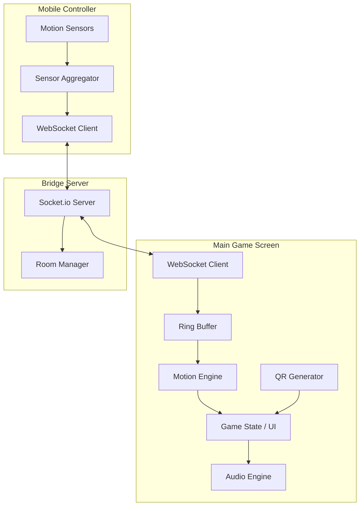
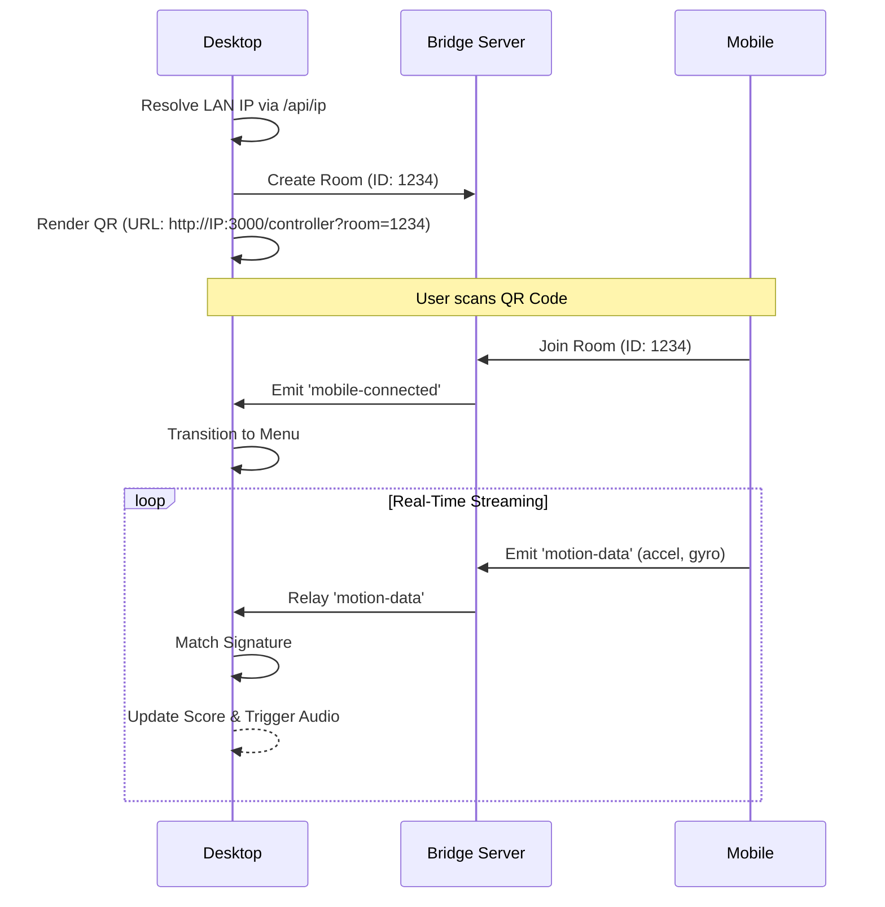

# Technical Design Document: SweatSnap

## 1. Executive Summary
SweatSnap is a cross-platform, zero-install motion-tracking workout suite. It leverages the high-fidelity Inertial Measurement Units (IMUs) found in modern smartphones to transform the device into a specialized motion controller. The system employs a dual-screen architecture communicating over a low-latency WebSocket bridge.

## 2. System Architecture

### 2.1 Component Overview
The system is partitioned into three discrete services to ensure separation of concerns and scalability.



### 2.2 Sequence Diagram: Device Pairing & Data Flow
This diagram illustrates the "Zero-Install" pairing protocol using dynamic IP resolution.



## 3. Detailed Technical Decisions

### 3.1 Low-Latency Communication
- **Protocol:** WebSockets (via Socket.io) were chosen over WebRTC for reliability and ease of "Room" management. 
- **Optimization:** The payload is kept minimal—raw `number` arrays for acceleration and rotation—to minimize serialization overhead. 
- **Stability:** The mobile controller uses `transports: ['websocket', 'polling']` to bypass restrictive corporate or home firewall settings.

### 3.2 Motion Detection Engine
The engine uses a window-based classification approach rather than a complex ML model to maintain <50ms processing latency.

| Game Mode | Placement | Dominant Signal | Logic |
| :--- | :--- | :--- | :--- |
| **Shadow Boxing** | Hand/Arm | Z-Accel / Y-Gyro | High-pass filtered spike detection on the thrust axis. |
| **Reflex Ridge** | Pocket | Y-Accel | Detecting vertical impulses (Jumps) vs drops (Ducks). |
| **Iron Pump** | Hand | Y-Accel Mag | Integral of acceleration over time to identify smooth arcs. |

### 3.3 Hydration & SSR Management
To prevent **React Hydration Mismatch** (caused by `window` access or `Math.random` during Server-Side Rendering), a `mounted` state pattern was implemented:
```typescript
const [mounted, setMounted] = useState(false);
useEffect(() => setMounted(true), []);
if (!mounted) return <Skeleton />;
```

## 4. UI/UX Design Engineering
The interface follows the **Emil Kowalski** philosophy of high-perceived performance:
- **Spring Physics:** All UI transitions use non-linear spring curves (`stiffness: 400, damping: 20`) to feel more organic.
- **3D Transforms:** Move callouts use CSS `perspective` and `rotateX` to give depth to the workout experience.
- **Barlow Condensed:** An italicized, high-contrast condensed font family is used to reinforce the athletic, high-intensity aesthetic.

## 5. Security & Single-Device Protocol
- **Supersession:** When a new `join-room` event occurs for an existing Room ID, the bridge server notifies the room. The Desktop app resets to the menu, effectively disconnecting the older device to prevent data interference.
- **Local Isolation:** The `/api/ip` discovery ensures the data never leaves the local network if possible, minimizing external latency.

## 6. Future Roadmap
- **V2:** Move to a Native Mobile App to access hardware Haptics.
- **V3:** Implement a specialized TensorFlow.js model on the desktop to support more complex combos (Uppercuts, Roundhouses).
- **V4:** Cloud-based multiplayer leaderboards.
