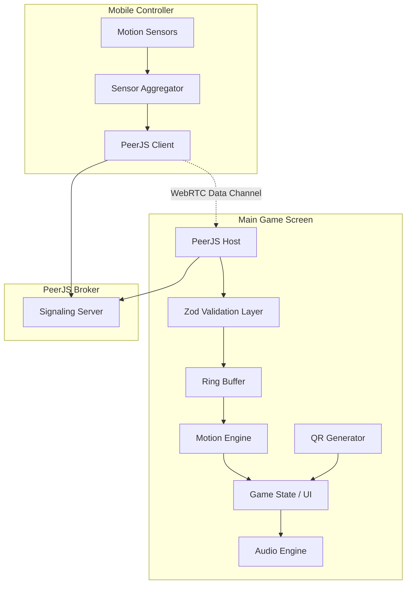

# System Architecture: pktgym

This document provides a comprehensive technical overview of **pktgym**—a zero-install, decentralized motion tracking system for web-based fitness gaming.

---

## 1. High-Level Topology

pktgym uses a **Dual-Client P2P Architecture**. Instead of a central server processing physics or motion, the heavy lifting is done by the user's Desktop/TV browser, while the smartphone acts as a high-frequency sensor array.



### Communication Flow
1. **Signaling:** Both devices connect to the PeerJS Broker using a shared `roomId`.
2. **P2P Handshake:** The broker facilitates an ICE handshake to establish a direct WebRTC Data Channel.
3. **Data Streaming:** Once connected, the Mobile Controller pushes raw IMU packets to the Desktop Host.
4. **Validation:** The Desktop Host uses **Zod schemas** to validate incoming packets, ensuring protocol integrity.

---

## 2. Core Components

### 2.1 The Motion Engine (`src/features/games/engine`)
The engine is a window-based classifier. It doesn't rely on expensive ML models; instead, it uses signal processing techniques:
- **Ring Buffer:** Stores the last 1.5 seconds of sensor data.
- **Peak Detection:** Analyzes spikes in acceleration (G-force) and angular velocity.
- **Signature Matching:** Compares current peaks against predefined "move signatures" (e.g., a Jab has high Z-axis acceleration).

### 2.2 The Connection Bridge (`src/features/connection`)
Uses PeerJS to manage the complex WebRTC lifecycle.
- **`useDesktopPeer`:** Manages the Host lifecycle, generates the QR code ID, and handles incoming mobile connections.
- **`useMobilePeer`:** Manages the Controller lifecycle, connects to the Host, and streams `DeviceMotionEvent` data.
- **Validation Layer:** A dedicated `schema.ts` file using Zod to ensure the data contract is enforced across both devices.

### 2.3 Mobile Controller (`src/features/controller`)
Designed for maximum performance and minimum battery drain.
- **Sampling Rate:** Targets 60Hz-100Hz depending on the device hardware.
- **Permissions:** Handles the iOS 13+ requirement for explicit Motion & Orientation permission.
- **Wake Lock:** Prevents the phone screen from sleeping during a workout.

---

## 3. Data Integrity & Zod

WebRTC data channels are untyped (`any`). To make **pktgym** robust and developer-friendly, we employ Zod validation at the bridge:

```typescript
// Example from src/features/connection/schema.ts
export const IMUDataSchema = z.object({
  accel: z.object({ x: z.number(), y: z.number(), z: z.number() }),
  gyro: z.object({ alpha: z.number(), beta: z.number(), gamma: z.number() }),
  timestamp: z.number().optional(),
});
```

This prevents malformed data from reaching the motion engine, making the system significantly easier to debug for contributors.

---

## 4. Connection Management & Resilience

### Offline-First Philosophy
While initial signaling requires an internet connection to reach the PeerJS broker, the actual gameplay is **local**. If your internet goes down but your local Wi-Fi remains active, the P2P WebRTC connection will persist.

### Connection Health
- **Active Heartbeat:** PeerJS maintains the connection state.
- **Reactive UI:** Both the Mobile and Desktop interfaces react immediately to a `disconnected` or `close` event, allowing the user to pause and re-pair if necessary.
- **Prefixing:** All PeerJS IDs are prefixed with `pktgym-` to avoid collisions on public signaling servers.

---

## 5. Security & Privacy

- **Encrypted P2P:** All data is transmitted over an encrypted WebRTC data channel.
- **No Data Retention:** Motion data is volatile. It exists in the Desktop's memory for 1.5 seconds (the buffer window) and is then discarded.
- **Zero Backend:** There is no user database. Your movement patterns are your own.
